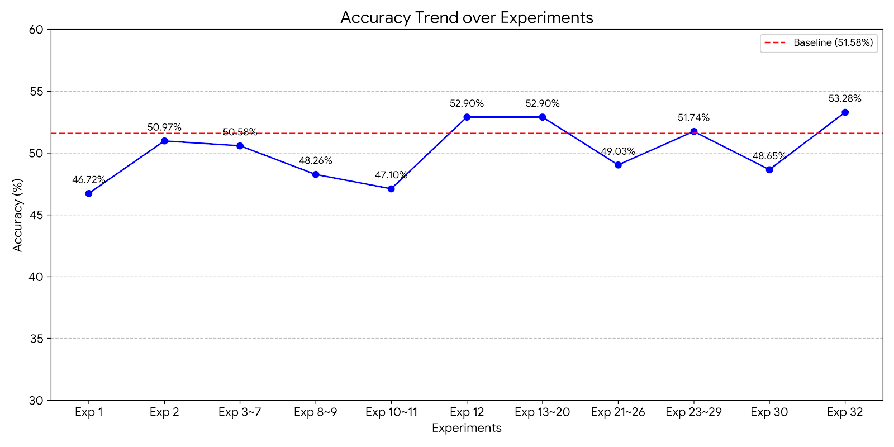

# RAG Agent System

## 프로젝트 개요

해당 프로젝트는 한국 법률 4지선다 객관식 문제(KMMLU Criminal-Law & Law) 풀이를 위한 Production 수준의 RAG 시스템 구축하는것이 목표이다.  
주어진 기간동안 달성한 추론 모델의 최대 성능(dev set 기준)은 `53.67%`로, Baseline `51.58%` 대비 `1.7%`의 향상을 이끌어 냈다.  

할 수 있는 최대한의 RAG 시스템 평가 지표를 나타내기 위해 AI Assistant와 로그 데이터 분석을 통해 무분별한 검색을 지양하고,  
RAG 활용 시 유용한 데이터만 제공하도록 유도하고, LLM의 Hallucination을 최소화하는 프롬프트 및 컨텍스트 경량화에 집중하였다.  

> 사용한 데이터셋의 출처는 다음과 같다. https://huggingface.co/datasets/HAERAE-HUB/KMMLU

## Agent System 구조와 실행 방법

Tech Stack: `FastAPI`, `Docker`  
Vector DB: `ChromaDB`

### 프로젝트 구조
```text
.
├── Dockerfile
├── Makefile
├── README.md
├── accuracy.png
├── config.py
├── data
│   ├── chroma_db
│   │   └── chroma.sqlite3
│   ├── collections.py
│   ├── dev.csv
│   ├── loader.py
│   ├── test.csv
│   └── train.csv
├── eval
│   ├── eval_dev.py
│   └── eval_test.py
├── logs
│   ├── eval-dev.log
│   └── eval.log
├── main.py
├── pyproject.toml
├── pyrightconfig.json
├── ruff.toml
├── service
│   ├── agent
│   │   ├── dto
│   │   │   ├── agent_request.py
│   │   │   └── agent_response.py
│   │   ├── openai_client.py
│   │   ├── openai_service.py
│   │   └── prompt
│   │       ├── response_schema.py
│   │       └── system_prompt.py
│   └── retrieval
│       ├── dto
│       │   └── retrieval_dto.py
│       └── retrieval_service.py
└── uv.lock
```

### 실행 방법

**1. 필수 패키지 설치**  
본인 로컬 환경에 `docker`, `uv`, `make`가 실행되도록 설치해주세요

**2. 가상 환경 실행**

다음 명령어로 가상 환경을 실행합니다. (Mac OS 기준)

```bash
source .venv/bin/activate
```

**3. 환경 변수 설정**  

.env 파일을 프로젝트 루트에 다음과 같이 생성하고, 값을 채워 넣어주세요
```text
# ENV should follow these strings ['DEBUG', 'INFO', 'WARN', 'CRITICAL']
ENV=

# OpenAI API token
OPENAI_API_KEY=
```

**4. 데이터 세팅**  

아래 명령을 입력하여 필요한 데이터셋을 자동으로 ChromaDB에 임베딩하여 적재합니다.
단, 반드시 `data`디렉토리에 `train.csv`가 존재해야 합니다.

```bash
make dataloader
```

**5. 빌드**  
도커 프로세스가 실행중인지 확인하고, 아래 명령을 입력하여 도커 이미지를 빌드해주세요.
```bash
make build
```

**6. 실행**  

아래 명령을 입력하여 로컬 환경에 RAG Agent System을 실행해주세요.

```bash
make run
```

**6. 평가**  

다른 콘솔 프로세스를 띄워서 평가 스크립트를 실행해야 합니다.
해당 어플리케이션은 `data/train.csv`와 `data/dev.csv`를 기준으로 개발되었습니다. 
때문에 `test.csv`를 준비하되, 위 두가지 포맷과 동일하게 제작하여 `data` 디렉토리 내부에 배치해주세요
이후, 프로젝트 루트에서 다음 명령을 실행하여 Docker container에서 서빙되는 API를 호출하는 평가 스크립트가 실행됩니다.

```bash
make evaluate-test
```

**7. 환경 제거**

평가가 종료되었으면 컨테이너 및 이미지를 다음 명령어를 입력하여 제거합니다.

```bash
make clean
```

### 개발자 가이드

**1. 환경 변수 설정**  
.env 파일을 프로젝트 루트에 다음과 같이 생성해주세요
```text
# ENV should follow these strings ['DEBUG', 'INFO', 'WARN', 'CRITICAL']
ENV=

# OpenAI API token
OPENAI_API_KEY=
```

**2. 데이터 세팅**  

아래 명령을 입력하여 필요한 데이터셋을 자동으로 ChromaDB에 임베딩하여 적재합니다.
단, 반드시 `data`디렉토리에 `train.csv`가 존재해야 합니다.

```bash
make dataloader
```

**3. 평가 실행**  
개발 후 RAG 시스템을 평가하기 위해 아래 명령을 실행해주세요
단, 반드시 `data`디렉토리에 `dev.csv`가 존재해야 합니다.

```bash
make evaluate-dev
```

---

## RAG Agent 성능 개선 실험

본 과제에서 주어진 기간동안 33회의 실험을 진행하였으며, 초기 RAG 시스템의 실패 원인을 AI Assistant와 함께 로그 기반으로 분석하여 점진적으로 아키텍처를 최적화를 시도하였다.

### Phase 1: 검색 시스템 구축 및 문제점 파악 (실험 1 ~ 7)

최초에 구현한 RAG 시스템은 주어진 `train.csv`뿐만 아니라 법령/법률 정보를 제공하는 추가 데이터셋을 활용하였다.
> 참고: https://huggingface.co/datasets/joonhok-exo-ai/korean_law_open_data_precedents

#### 가설

RAG는 LLM이 모르는 도메인 지식을 검색하여 프롬프트에 주입함으로써 정확한 추론을 유도하는 시스템이다.
따라서 **외부 법률 데이터(판례/법령)와 유사 기출문제를 많이 제공할수록 LLM의 추론 정확도가 올라갈 것**이라는 가설을 세웠다.

#### 구현

**1. 벡터 데이터베이스 선정 및 구축**

과제 요구사항(Docker 단독 빌드, 10분 이내 추론, 200MB 제출 제한)을 고려하여 경량 벡터 DB를 조사하였다.
ChromaDB, Milvus Lite, FAISS, Qdrant를 비교한 결과, 별도 서버 없이 파일 시스템으로 동작하고 구축한 데이터를 그대로 제출할 수 있는 **ChromaDB**를 선택하였다.
임베딩 모델은 과제에서 지정한 `text-embedding-3-small`을 사용하였다.

**2. 데이터 적재**

ChromaDB에 두 개의 컬렉션을 구성하였다:
- `questions`: `train.csv` 2,073건의 문제+선지+정답을 함께 임베딩하여 적재
- `korean_law`: 외부 판례 데이터셋에서 `행정`(8,000건) + `형사`(2,000건)를 추출하여 판시사항과 판결요지를 임베딩

법률 데이터의 경우, 85k건 전체를 적재하면 이미지 빌드 시간과 제출 용량을 초과하므로 `train.csv`/`dev.csv`의 카테고리 분포(Law 89%, Criminal Law 11%)에 맞춰 10k건만 선별하였다.

**3. 검색 시스템 및 프롬프트 구성**

프롬프트 엔지니어링 기법을 조사하여 Few-Shot + 짧은 CoT를 결합한 전략을 채택하였다.
유사 기출문제(Few-Shot)와 관련 판례(도메인 지식)를 함께 프롬프트에 주입하는 구조이다:

```text
### 유사 기출문제
1. [문제 + 선지 + 정답]

### 관련 법령/판례
1. [판시사항 + 판결요지]

### 문제
[질문 + 선지 A~D]
```

시스템 프롬프트에는 법률 전문가 역할을 부여하고, 각 선지를 O/X로 판정한 뒤 문제 조건에 맞는 정답을 고르도록 지시하였다.
응답 포맷은 OpenAI Structured Output을 활용하여 `question_type`, `analysis_A~D`(각 선지별 judgment+reason), `answer`의 7개 필드를 강제하였다.

검색 파라미터는 근거 없이 넉넉하게 설정하고(Question K=3, Law K=3, Threshold=0.5), 평가를 통해 튜닝하는 전략을 수립하였다.

#### 실험 결과

**최초 평가 (유사 기출 K=3 + 법령 참조 K=3): 50.97% (132/259, Baseline 51.58% 미달)**

AI Assistant를 활용한 로그 분석으로 법령/판례 데이터가 성능을 악화시키고 있음을 발견하였다:

| 조건 | 정확도 |
|------|--------|
| 법령 참조 0개 | **70.4%** (50/71) |
| 법령 참조 > 0개 | 43.6% (82/188) |

판례 데이터(판결요지/판시사항)와 시험 문제(법 조문의 O/X 판정)는 근본적으로 다른 도메인이었다.
이를 기반으로 법령/판례를 비활성화하고, DB 저장 방식 개선(질문만 임베딩 + Semantic Chunking) 및 파라미터 튜닝을 진행하였다.

**DB 재구성 후 평가 (유사 기출 K=5, 법령 비활성화): 50.19% (130/259)**

DB 재구성 후 로그를 분석한 결과, 유사 기출문제 검색에서도 심각한 문제가 발견되었다:

| 유사 기출 거리 구간 | 정답률 |
|-------------------|--------|
| 0.0 ~ 0.1 (극근접) | **39.5%** ← 최악 |
| 0.1 ~ 0.3 (유사) | 55.7% |
| 0.3 이상 (먼 거리) | 48.4% |

극근접 유사 기출(Distance < 0.1)은 텍스트가 거의 동일하지만 "옳은 것은?" ↔ "옳지 않은 것은?"으로 조건이 반전된 함정 문항이었다.
LLM이 본 문제의 조건을 독립적으로 추론하지 않고, 프롬프트에 주입된 과거 기출의 정답을 맹목적으로 복사하는 편향이 발생하였다.

추가로 Zero-shot(검색 없이 모델 자체 지식만) 평가 결과 46.72%(121/259)를 기록하여, 유사 기출 검색 자체는 +4.25%p의 긍정적 효과가 있음도 확인하였다.

이후 프롬프트 경량화(50.58%), Distance Threshold 도입(46.71~48.26%) 등의 추가 실험을 진행하였으나 Baseline을 돌파하지 못하였다.

### Phase 2: 검색 파이프라인 고도화 시도 (실험 8 ~ 11)

Phase 1의 문제점(조건 반전 편향, 도메인 불일치)을 검색 파이프라인 단에서 해결하기 위해 두 가지 접근을 시도하였다.

#### BM25 하이브리드 검색 (실험 8 ~ 9)

##### 가설

Phase 1에서 발견한 조건 반전 문제의 원인은 순수 의미 기반(Semantic) 검색이 "옳은 것은?"과 "옳지 않은 것은?"을 구분하지 못하는 데 있었다.

두 문장은 임베딩 벡터 거리가 거의 0에 가까울 정도로 유사하지만 정답은 정반대이다.

정확한 단어 일치를 기반으로 하는 키워드 검색을 결합하면, "옳지"라는 부정 토큰의 유무를 변별하여 조건 반전을 극복할 수 있을 것이라는 가설을 세웠다.

##### 구현

BM25(Best Matching 25) 키워드 검색 알고리즘을 도입하고, 의미 검색 결과와 키워드 검색 결과를 RRF(Reciprocal Rank Fusion)로 결합하는 하이브리드 검색을 구현하였다.

한국어는 조사가 어간에 붙는 교착어 특성이 있어 BM25를 적용하려면 별도의 토크나이저가 필요하다.

KoNLPy와 같은 형태소 분석기를 사용하면 정확하지만 Java 런타임 의존성이 추가되어 Docker 이미지가 무거워진다.

이에 외부 의존성을 최소화하기 위해 정규표현식 기반의 경량 한국어 토크나이저를 AI Assistant를 활용하여 직접 구현하였다.

조사 스트리핑(`"형법에"` → `"형법"`)과 불용어 필터링을 통해 법률 키워드 매칭 품질을 확보하였다.

##### 실험 결과

**실험 8 - BM25 하이브리드 (RRF): 48.26% (125/259)**  

| 거리 구간 | 이전 (Semantic Only) | BM25 Hybrid (RRF) | 변화 |
|----------|---------------------|-------------------|------|
| 0.00 ~ 0.05 | 43.75% | 28.6% | -15%p |
| 0.10 ~ 0.20 | **63.15%** | **50.0%** | **-13%p** |
| 0.30 ~ 0.50 | 37.70% | 49.3% | +11.6%p |

핵심 유효 구간(0.1~0.2)에서 RRF가 의미 검색의 좋은 결과를 교란하여 -13%p 하락하였다.

조건 반전 구간(0~0.05)은 28.6%로 여전히 최악이었는데, "옳지" vs "옳은"은 단 1개 토큰 차이이므로 BM25 점수 차이가 미미하여 변별 불가능하였다.

**실험 9 - RRF 조건부 적용(dist ≤ 0.3이면 Semantic, dist > 0.3이면 RRF): 개선 실패**

두 가지 원인으로 조건부 전략이 효과를 발휘하지 못하였다.

첫째, **BM25가 의미 검색이 놓친 새로운 문서를 발굴하지 못하였다.** 실험 8의 로그 분석에서 RRF top-1이 모두 의미 검색에서도 등장한 문서였으며, BM25 단독으로 발견한 문서는 0건이었다. 따라서 dist > 0.3 구간에서 RRF로 전환해도 결국 의미 검색과 동일한 문서가 재선택될 뿐, 검색 품질의 실질적 개선이 없었다.

둘째, **먼 거리 구간에 참조를 주입하는 것 자체가 역효과였다.** dist > 0.3인 문항은 유사한 기출 자체가 존재하지 않는 문항들이다. 이전 실험에서 "참조 없이 70%"의 높은 정답률을 보였던 구간이 바로 이 dist > 0.3 문항들이었으며, 이는 모델이 관련 없는 참조에 혼란받지 않고 자체 지식으로 독립 추론했기 때문이었다. RRF로 전환하여 관련성이 낮은 참조를 강제 주입하면 오히려 모델의 독립 추론을 방해하여 zero-shot 대비 성능이 하락하였다.

#### 조건 반전 함정 차단 및 법령/판례 재도입

##### 가설
dist < 0.1 구간(약 42건)의 정답률이 28~44%로 최악인 것은 조건 반전 함정 때문이다.
이 구간의 유사 기출을 **일괄 차단**하면 모델이 독립적으로 추론하여 정답률이 올라갈 것이다.
또한 유사 기출 대신 **법령/판례를 재도입**하면 답안 복사 유인 없이 법적 근거만 참고할 수 있을 것이라는 가설을 세웠다.

##### 실험 결과

실험 10 - 함정 차단(dist < 0.1 제외) + 법령/판례 재도입: **45.95%** (119/259)

| 조합 | 정답률 | 건수 |
|------|--------|------|
| 기출X + 법령X | 44.0% | 25건 |
| 기출X + 법령O | 33.3% | 21건 |
| 기출O + 법령X | **49.0%** | 157건 |
| 기출O + 법령O | 42.9% | 56건 |

법령이 주입되면 기출 유무와 관계없이 6~11%p 하락하는 것이 명확히 확인되었다.

실험 11 - 함정 차단 단독(법령 비활성화): **47.10%** (122/259). 기출 미주입 구간이 기대했던 70%대에 한참 못 미치는 43.5%에 머물렀다. dist < 0.1인 문항에는 함정뿐만 아니라 실제로 도움이 되는 유사 기출도 포함되어 있어, 일괄 차단이 유용한 참조까지 함께 제거하는 역효과를 낳았다.

#### 결론
검색 파이프라인에서 시도할 수 있는 주요 전략(하이브리드 검색, 조건부 RRF, 함정 차단, 법령 재도입)을 모두 소진하였으나 Baseline을 돌파하지 못하였다.
이를 통해 **검색 품질 개선만으로는 한계가 있으며, 근본적으로 생성 단계의 최적화가 필요하다**는 판단에 이르렀다.

### Phase 3: 생성 최적화 (실험 12 ~ 20)

#### 가설

Phase 2에서 결론을 내렸다시피, 검색 품질의 문제가 아니라 **gpt-4o-mini 모델이 방대한 컨텍스트를 소화하지 못해 할루시네이션을 일으키는 것이 근본 병목**이라는 가설을 세웠다.
따라서 현재 추론 모델에 전달하는 컨텍스트와 출력 스키마를 덜어내는 방향으로 전략을 전환하였다.

#### 구현

| 항목 | 변경 전                                                           | 변경 후                         |
|------|----------------------------------------------------------------|------------------------------|
| **Response Schema** | `question_type`, `analysis_A~D`, `reasoning`, `answer` 총 7개 필드 | `reasoning`, `answer` 총 2개 필드 |
| **System Prompt** | 긴 지시문 + 법령 참조 언급 + 4단계 필수 논리 순서                                | 핵심 규칙 4줄로 압축                 |
| **참조 데이터** | 유사 기출 K=3~5 + 법령/판례                                            | 유사 기출 **K=1만**     |

#### 실험 결과

**실험 12 - 프롬프트/스키마 간소화: 52.90% (137/259, Baseline 첫 돌파)**

| 거리 구간 | 정답 | 문항 수 | 정확도 |
|-----------|------|---------|--------|
| [0.00, 0.05) | 6 | 15 | 40.0% |
| [0.05, 0.10) | 20 | 31 | **64.5%** |
| [0.10, 0.20) | 40 | 77 | 51.9% |
| [0.20, 0.30) | 32 | 65 | 49.2% |
| Fallback (>0.30) | 39 | 71 | 54.9% |

해당 실험을 통해 첫 Baseline을 돌파하였다.  
또한, 로그 분석에서 두 가지 추가적인 문제를 발견하였다.  
- **D 편향**: D를 95건(36.7%) 예측하여 실제 비율(30.9%)을 크게 초과하고, D로 잘못 예측한 44건이 확인되었다.
- **조건 반전 약점**: "옳지 않은 것" 유형 47문항의 정답률이 40.4%로 전체 평균(52.9%) 대비 12.5%p 낮았다.

이 두 문제를 해결하기 위해 파라미터 수정과 기존 방법을 활용하여 실험 13~20에서 다양한 시도를 해보았다.

| 실험 | 시도 | 결과 | 비고 |
|------|------|------|------|
| 13 | Temperature 0→0.3 | 49.42% | 확실한 답까지 흔들림 |
| 14 | Self-Consistency 3회 다수결 | 52.90% | 비용 3배, 이득 없음 |
| 15 | K=2 (유사 기출 2개) | 49.81% | 컨텍스트 과잉 |
| 16 | K=3 (유사 기출 3개) | 49.42% | 더 악화 |
| 17 | D 편향/조건 반전 프롬프트 교정 | **42.08%** | D 편향 36.7%→59.1%로 폭증 |
| 18 | Threshold [0.05, 0.2]로 축소 | 51.74% | Fallback이 여전히 주입 |
| 19 | BM25 하이브리드 재시도 | 50.19% | 프롬프트 무관하게 악화 |
| 20 | 임베딩에 선지 포함 | 49.81% | 선지가 임베딩 노이즈 |

#### 결론

1. **컨텍스트는 적을수록 좋다**: K를 늘리거나 법령을 추가하면 모델의 추론 능력이 떨어지는 경향이 있었다.
2. **Temperature=0**: 4지선다 객관식에서 확률적 탐색은 확실하게 대답하던 문제까지 틀리게 만드는 경우가 발생하였다.
3. **메타 규칙을 주면 역효과**: "D를 선호하지 마라", "O/X 개수 제약" 등의 메타 규칙은 추론을 돕는 것이 아니라 제약을 가하여 성능을 크게 악화시킨다.
4. **모델의 근본적 한계**: gpt-4o-mini의 한국 법률 지식 자체가 적기 때문에 동일 모델을 여러 번 호출해도 "모르는 문제"는 맞힐 수 없다.

---

### Phase 4: 추론 분리와 외부 지식 주입 시도 (실험 21 ~ 26)

Phase 3에서 `52.90%`를 달성했으나, 이전 실험을 통해 발견한 개선 사항이 남아있어 추가 개선을 시도해보았다.  
이를 해결하기 위해서 추론 구조 자체를 변경하거나, 새로운 형태의 외부 지식을 주입하는 방향을 시도하였다.

#### 실험 21~22: 2단계 추론으로 분리

##### 가설

Phase 3 분석에서, 조건 반전 문제의 정확도가 40.4%로 가장 낮았다.  
그 이유를 생각해보았을 때 모델이 각 선지의 O/X 판정과, 문제 조건에 맞는 정답 선택을 한 번의 호출에서 동시에 처리하면서  
논리적인 추론을 수행하기 때문에 `gpt-4o-mini`의 문제인 `컨텍스트` 자체가 부족하여 올바르지 않은 답변을 내놓는것이 아닐까? 라는 가설을 세웠다.  
따라서 문제 분석과 답변 생성을 하나의 질의에서 하는것이 아닌 두 단계로 분리하면 각 단계의 부하가 줄어서 정확도가 향상될 것이라는 기대를 하였다.

##### 구현

아래와 같이 2단계로 추론하는 구조를 만들었다.
```text
Step 1: 각 선지의 O/X 판정 (법률 지식에만 집중, 정답 선택 없음) -> Output: { A: "O", B: "O", C: "X", D: "O" }

Step 2: 문제 조건 -> O/X 결과 -> 정답 선택 (단순 조건 매칭) -> Output: { answer: "C" }
```

##### 실험 결과

| 실험 | 정확도 | API 호출 |
|------|--------|---------|
| 실험 12 (1단계, 기준) | **52.90%** | 259 |
| 실험 21 (2단계, Rate Limit으로 146문항) | 47.26% | 518 |
| 실험 22 (2단계, 전체 259문항) | 49.03% | 518 |

로그를 확인해보았을 때 Step 2(조건 매칭)의 경우에는 **98.7%** 정확도로 거의 완벽하게 선택하였다.
하지만 여전히 근본적인 추론을 수행하는 Step 1에서 각 선지에 대해 정확하게 추론하지 못한다는 문제가 존재하였다.
또한, 해당 과정에서 Step 1으로부터 반환된 결과가 `모두 옳다(O 4개)` 같은 무의미한 판정이 `15.4%`까지 증가하였다.

#### 실험 25~26: 법률 사실 지식 베이스

##### 가설

Phase 1에서 판례 데이터가 좋은 영향을 미치지 못한 이유는 유사도 검색 시 시험 문제와 근본적인 도메인이 불일치했기 때문에  
불필요한 데이터가 섞여 들어가서 모델의 추론을 방해했기 때문이라고 생각했다.  
따라서 생각을 바꾸어서, `train.csv`의 정답 선지 텍스트는 검증된 법률 사실이기 때문에,  
이를 별도 컬렉션으로 임베딩하면 도메인이 정확히 일치하는 외부 지식을 제공할 수 있지 않을까? 라는 가설을 세웠다.

##### 구현

"옳지 않은 것" 유형의 정답을 제외하고, 긍정형 정답 선지 642건을 `legal_facts` 컬렉션으로 새롭게 데이터베이스를 구축하였다.  
실험 25에서는 기존 파이프라인에 `legal_facts` 검색 결과를 추가하는 방식으로 구현하였고,  
실험 26에서는 각 선지를 개별적으로 질의할 때 `legal_facts` 검색 결과와 함께 판정하는 파이프라인을 시도하였다.

##### 실험 결과

| 실험 | 방식 | 정확도 | API 호출 |
|------|------|--------|---------|
| 실험 12 (기준) | 유사 기출 1개, 단일 호출 | **52.90%** | 259 |
| 실험 25 | +법률 사실 3개 주입 | 49.81% | 259 |
| 실험 26 | 선지별 개별 판정 + 사실 | **33.20%** (역대 최저) | 1,295 |

실험 25에서는 사실이 0개인 문항(`57.6%`)이 3개 주입 문항(`48.3%`)보다 높아서,  
도메인이 일치하더라도 외부 지식의 추가는 일관되게 좋지 않는 성능을 보인다는 점을 확인하였다.  
또한, 실험 26은 실험 21~22에서 발견했던 추론 분리 문제가 그대로 다시 발생하여서 역대 최저(`33.20%`)를 기록하였다.

#### 결론

1. **추론 분리의 한계:** 추론 분리는 gpt-4o-mini에서 좋은 성능을 보이지 못했다. Step 2의 조건 매칭은 98.7%로 우수했으나, 근본 추론을 수행하는 Step 1의 판정 품질이 애초에 좋지 않았다.
2. **외부 컨텍스트의 역효과:** 도메인 일치 여부와 무관하게, 외부 컨텍스트 추가는 일관되게 좋지 않은 성능을 보여준다.

---

### Phase 5: 편향 보정 시도 (실험 23 ~ 29)

Phase 2, 3, 4에서 발견한 **D 편향**(36.7%)과 **조건 반전 약점**(40.4%)을 개선해보고자 프롬프트 또는 추론 전략 수준의 변경을 통해 개선할 수 있는지 시도하였다.

#### 실험 23~24: 조건 반전 마커

##### 가설

"옳지 않은 것" 유형의 정확도가 40.4%로 최악인 것은, 모델이 문제 조건을 놓치기 때문이다.  
따라서 프롬프트에 **시각적 강조 마커**를 삽입하면 조건 인지를 도울 수 있을 것이라는 가설을 세웠다.  
실험 17(메타 규칙 부여)과 달리 "O=3, X=1" 같은 제약 없이 **조건 강조만** 수행하는 점이 다르다.

##### 구현

부정 조건을 정규식으로 감지하여 문제 앞에 마커를 삽입하였다.  
실험 23에서는 넓은 패턴(170건/65.6%에 적용),  
실험 24에서는 `옳지 않은 것`에만 한정(133건/51.4%에 적용)하여 구현하였다.

> 여기서 넓은 패턴이란, '옳지 않은', '적절하지 않은', '해당하지 않는', '포함되지 않는', '아닌 것'과 같이 넓은 부정 조건 패턴을 의미한다.

##### 실험 결과

** 실험 23~24 - 조건 반전 마커: (전체 성능 악화)**

| 실험 | 적용 범위 | 전체 정확도 | "옳지 않은 것" 정확도 |
|------|----------|-----------|-------------------|
| 실험 12 (기준) | - | **52.90%** | 40.4% |
| 실험 23 (넓은 마커) | 170건 | 48.65% | 46.6% |
| 실험 24 (좁은 마커) | 133건 | 50.58% | **48.9%** |

"옳지 않은 것" 유형은 40.4% → 48.9%로 개선되었으나, 마커 삽입 자체가 프롬프트 구조를 변경하면서 기타 문제의 정확도를 끌어내려 전체 성능은 악화되었다.  
Phase 3에서 확인한 "프롬프트가 짧을수록 성능이 좋다"는 것과 일관된 결과이다.  

#### 실험 27~29: Choice Shuffling

##### 가설

D 편향은 모델이 마지막 선지를 과도하게 선호하는 위치 편향이다.  
따라서 선지 순서를 셔플하여 동일 문제를 2회 호출한 뒤 결과를 비교하면, 위치에 의존하지 않고 답을 도출할 수 있을 것이라는 가설을 세웠다.  
이전 실험들이 프롬프트에 정보를 추가하는 방식이라 실패한 반면, shuffling은 동일한 정보에서 순서만 변경하므로 근본적으로 다른 접근이다.  

##### 구현

문항별로 question_id를 기준으로 원래 순서와 셔플 순서를 병렬 호출한 뒤, 셔플 결과를 원래대로 역매핑하였다.  
두 결과가 일치하면 채택하고, 불일치하면 원래 결과를 사용하도록 구성하였다.  
또한, 해당 과정에서 약간의 프롬프트 변경을 수행했었는데, 프롬프트 수정의 의 영향과 shuffling의 영향을 분리하기 위해 3개의 조합을 테스트하였다.

##### 실험 결과

**실험 27~29 - Choice Shuffling: (비용 대비 이득 없음)**

| 실험 | 프롬프트        | Shuffling | 정확도 |
|------|-------------|----------|--------|
| 실험 12 (기준) | 기존          | X | **52.90%** |
| 실험 27 | 새로운 프롬프트 사용 | O | 51.74% |
| 실험 28 | 새로운 프롬프트 사용 | X | 49.81% |
| 실험 29 | 기존          | O | 50.19% |

세 실험 전부 가장 높은 정확도를 보인 `실험12`보다 나은 성능을 보이지 않았다.

#### Phase 5 결론

1. **조건 반전 마커:** 부정문 유형에서는 효과가 있었지만, 프롬프트 추가 텍스트가 전체 성능을 희생시킨다.
2. **Choice Shuffling:** 위치 편향을 보정할 수 있지만, 원본 요청과 셔플한 요청의 불일치가 너무 높아(40% 불일치) 실효성이 없다. (비용 2배 대비 이득 없음)
3. **프롬프트 민감도:** 시스템 프롬프트 변경(-3.09%p)이 shuffling 효과(+1.93%p)보다 크다. 프롬프트의 미세한 변경이 성능에 큰 영향을 미친다는 점을 깨달았다.

### Phase 6: Query Classification + 프롬프트 개선 (실험 30 ~ 33)

Phase 5까지의 실험에서 반복적으로 관찰된 "외부 컨텍스트가 적을수록 정확도가 높다"는 패턴에 주목하였다.
또한, 질 낮은 참조를 제거하고 모델의 자체 추론 능력을 활용하되, 프롬프트를 개선하여 양질의 참조를 더 효과적으로 활용하면 성능이 향상될 것이라는 가설을 세웠다.

#### 실험 30: Query Classification

##### 가설

"Searching for Best Practices in Retrieval-Augmented Generation" 논문에서 제시된 **Query Classification**(검색 필요 여부 판정) 개념을 적용하였다.  
현재 시스템은 threshold [0.0, 0.3] 내에 유사 기출이 없을 경우에도 fallback으로 가장 가까운 기출 1개를 강제 주입하고 있었다.  
`dist > 0.3`인 검색 결과를 강제로 주입하는 것보다 아예 주입하지 않고 모델이 자체 지식만으로 추론하도록 하는 것이 나을 수 있다고 생각해보았다.  

##### 구현

`retrieval_service.py`에서 fallback 로직을 제거하였다.  
threshold 내에 유사 기출이 없으면 빈 리스트를 반환하여, 프롬프트에 유사 기출 섹션 없이 문제만 전달하도록 변경하였다.

##### 실험 결과

**실험 30 - Fallback 제거: 48.65% (126/259)**

| 구분 | 건수 | 정확도 |
|------|------|--------|
| 참조 0개 (zero-shot) | 70건 | **60.0%** |
| 참조 1개 (RAG) | 189건 | 44.4% |

zero-shot이 60.0%로 참조가 주입된 문항(44.4%)보다 압도적으로 높았다. 이는 이전 모든 실험의 "컨텍스트가 적을수록 좋다" 패턴을 확실히 보여주는 결과였고,  
gpt-4o-mini의 순수 법률 추론 능력이 적절한 프롬프트에서는 예상보다 높다는 것을 알게 되었다.  
하지만 전체 정확도는 48.65%로 RAG 문항의 낮은 정확도가 전체 성능을 끌어내렸다.

#### 실험 31~33: 시스템 프롬프트 개선 + Fallback 제거 + K 조정

##### 가설

실험 30에서 zero-shot 60%라는 높은 수치를 확인한 후,  
fallback 제거를 유지하면서 시스템 프롬프트를 개선하여 RAG 문항의 참조 활용도를 높이면 전체 성능을 끌어올릴 수 있다는 가설을 세웠다.

##### 구현

시스템 프롬프트의 유사 기출 활용 지시를 변경하였다:

| 항목 | 변경 전 | 변경 후 |
|------|---------|---------|
| **참조 활용 방식** | "유사 기출의 정답을 복사하지 마세요" | "유사 기출문제가 제공되면 개념 참고용으로만 활용하되, 문제 풀이의 논리 단계를 익히기 위해 유사 기출문제의 정답을 기반으로 유사 기출문제의 답 도출" |

핵심 차이는 단순히 "복사하지 마라"는 금지에서, 유사 기출을 직접 풀어보면서 **풀이 논리를 학습**하도록 능동적 활용을 유도한 것이다.  
이 프롬프트 변경과 함께 K값(참조 개수)을 1~3으로 조정하며 최적 조합을 탐색하였다.

##### 실험 결과

**실험 31 - 새 프롬프트 + Fallback 제거 + K=1: 51.74% (134/259)**

| 구분 | 건수 | 정확도 |
|------|------|--------|
| 참조 0개 | 70건 | **60.0%** |
| 참조 1개 | 189건 | 48.7% |

실험 30(원래 프롬프트 + fallback 제거)과 비교하면, zero-shot은 동일(60.0%)하다.  
하지만 RAG 문항의 정답률이 44.4%에서 48.7%로 개선되었다. 새 프롬프트가 참조 활용도를 높인 것을 확인하였다.

**실험 32 - 새 프롬프트 + Fallback 제거 + K=2: 53.28% (138/259, 최종 최고 기록)**

| 구분 | 건수 | 정확도 |
|------|------|--------|
| 참조 0개 | 70건 | **64.3%** |
| 참조 1개 | 39건 | 56.4% |
| 참조 2개 | 150건 | 47.3% |

이전 실험 15에서 K=2는 -3.09%p 악화되었으나, 당시와는 두 가지 조건이 달랐다.  
새 프롬프트가 복수 참조의 풀이 논리를 효과적으로 학습하도록 유도하고,  
fallback 제거가 threshold 내의 양질 참조만 주입되도록 보장하여, 두 조건의 시너지가 K=2에서 +1.54% 개선되는 효과를 이끌어내게 되었다.

**실험 33 - 새 프롬프트 + Fallback 제거 + K=3: 51.74% (134/259)**

| 구분 | 건수 | 정확도 |
|------|------|--------|
| 참조 0개 | 70건 | 60.0% |
| 참조 1개 | 39건 | 59.0% |
| 참조 2개 | 20건 | 45.0% |
| 참조 3개 | 130건 | 46.2% |

K=3은 K=2 대비 하락하였다. 참조가 3개로 늘면 컨텍스트가 과도해져 모델의 혼란이 재발하는 것을 확인하였다.  

##### 실험 31~33 종합

| 실험 | 프롬프트 | Fallback | K | 정확도 |
|------|---------|----------|---|--------|
| baseline | 새 | O | 1 | 49.81% |
| 실험 31 | 새 | X | 1 | 51.74% |
| **실험 32** | **새** | **X** | **2** | **53.28%** |
| 실험 33 | 새 | X | 3 | 51.74% |

#### 결론

1. **Fallback 제거가 일관되게 효과적이었다**: 유사하지 않은 내용에 대한 참조를 제거하고 모델의 자체 추론 능력(zero-shot 60~64%)을 활용하는 것이 유리하다.
2. **프롬프트와 K의 상호작용**: "풀이 논리를 학습하라"는 프롬프트는 K=2에서 시너지를 발휘하지만, K=3에서는 과잉 컨텍스트로 역전된다.
3. **이전 결론이 조건 변경 시 뒤집힐 수 있다**: K=2가 이전에는 악화(-3.09%p)되었으나, 프롬프트 + fallback 조합이 바뀌면서 개선(+1.54%p)으로 전환되었다.

---

### 최종 결론

#### 한계

6개 Phase에 걸쳐 총 33회의 실험을 진행한 결과,  
가장 좋은 성능을 보였던 설정을 `dev.csv`를 사용하여 여러번 시도해보았을 떄 최대 지표인 **53.67%**를 확인할 수 있었다.  
이전 실험 32에서 53.28%를 기록한 것도 이 변동 범위의 상단 부분에 해당하는 결과였던 셈으로,  
gpt-4o-mini가 사실상 확신 없이 답하는 문항이 실행마다 달라지면서 이정도의 편차가 발생한 것임을 확인하게 되었다. 

```text
{"@timestamp":"2026-03-30T11:19:22.921Z","log.level":"info","message":"accuracy: 134/259 = 0.5174 (245.8s)","log":{"logger":"rag_agent","original":"accuracy: 134/259 = 0.5174 (245.8s)"}}
{"@timestamp":"2026-03-30T11:25:17.187Z","log.level":"info","message":"accuracy: 132/259 = 0.5097 (218.2s)","log":{"logger":"rag_agent","original":"accuracy: 132/259 = 0.5097 (218.2s)"}}
{"@timestamp":"2026-03-30T11:29:32.866Z","log.level":"info","message":"accuracy: 135/259 = 0.5212 (219.9s)","log":{"logger":"rag_agent","original":"accuracy: 135/259 = 0.5212 (219.9s)"}}
{"@timestamp":"2026-03-30T11:33:33.871Z","log.level":"info","message":"accuracy: 139/259 = 0.5367 (233.9s)","log":{"logger":"rag_agent","original":"accuracy: 139/259 = 0.5367 (233.9s)"}}
{"@timestamp":"2026-03-30T11:37:22.028Z","log.level":"info","message":"accuracy: 126/259 = 0.4865 (218.7s)","log":{"logger":"rag_agent","original":"accuracy: 126/259 = 0.4865 (218.7s)"}}
{"@timestamp":"2026-03-30T11:41:26.048Z","log.level":"info","message":"accuracy: 128/259 = 0.4942 (231.4s)","log":{"logger":"rag_agent","original":"accuracy: 128/259 = 0.4942 (231.4s)"}}
```

#### 정확도 추이 및 결론

아래는 전체 실험에서 발견한 정확도의 추이이다.

> 다시 언급하자면, 해당 시도는 실험 당시 측정한 결과로, 다시 동일한 조건으로 재측정하였을 때 모델의 비결정성으로 인해 평가 결과가 달라질 수 있다.



| # | 실험 | 정확도 | 변화 |
|---|------|--------|------|
| 1 | Zero-shot (RAG 없음) | 46.72% | - |
| 2 | RAG (Questions + Law, K=3) | 50.97% | +4.25%p |
| 3~7 | DB 재구성, 프롬프트 경량화, Threshold 튜닝 | 46.71~50.58% | 개선 실패 |
| 8~9 | BM25 하이브리드 / RRF 조건부 적용 | 48.26% | 개선 실패 |
| 10~11 | 함정 차단 + 법령/판례 재도입 | 45.95~47.10% | 개선 실패 |
| **12** | **프롬프트/스키마 간소화** | **52.90%** | **Baseline 첫 돌파** |
| 13~20 | Temperature, Self-Consistency, K 조정 등 | 42.08~52.90% | 개선 실패 |
| 21~26 | 2단계 추론 분리, 법률 사실 KB | 33.20~49.03% | 개선 실패 |
| 23~29 | 조건 반전 마커, Choice Shuffling | 48.65~51.74% | 개선 실패 |
| 30 | Fallback 제거 (Query Classification) | 48.65% | zero-shot 60% 발견 |
| **32** | **새 프롬프트 + Fallback 제거 + K=2** | **53.28%** | **최종 최고 기록** |

30회 이상의 실험을 통해 도출한 결론은 다음과 같다.

**1. RAG에서 "더 많은 컨텍스트 = 더 나은 성능"은 성립하지 않는다.**  
Phase 1에서 세운 "외부 데이터를 많이 제공할수록 정확도가 올라간다"는 최초 가설은 완전히 틀린 가설이었다.  
법령/판례 데이터는 일관되게 성능을 악화시켰고, 유사 기출도 K=1을 초과하면 오히려 혼란을 가중시켰다.  
gpt-4o-mini 수준의 모델에서는 **컨텍스트의 Quantity** 보다 전달되는 **컨텍스트의 Quality**가 결정적이었다.

**2. 검색 개선보다 생성 최적화가 효과적이었다.**  
Phase 1~2에서 BM25 하이브리드, RRF, 함정 차단 등 검색 파이프라인을 고도화해보았지만, Baseline을 돌파하지 못하였다.  
반면 Phase 3에서 프롬프트와 응답 스키마를 간소화하자 52.90%로 첫 돌파에 성공하였다.  
이는 "적절한 문서를 찾지 못하는 것"이 아니라 "찾은 문서를 모델이 제대로 소화하지 못하는 것"에 있었음을 의미한다.

**3. 모델의 자체 추론 능력은 과소평가되어 있었다.**  
Phase 6에서 fallback을 제거하자 참조 없는 문항의 정확도가 60~64%에 달하였다.  
이는 RAG 문항보다 압도적으로 높은 수치로, 여러가지의 참고 자료를 주입하는 것보다 모델의 독립 추론을 신뢰하는 것이 유리하였다.  
최종 최적 구성에서 zero-shot 문항이 전체 성능을 견인한 것이 이를 뒷받침한다.

**4. RAG 시스템의 파라미터는 상호작용하며, 개별 최적화는 전체 최적화를 보장하지 않는다.**  
K=2는 Phase 3에서 성능이 좋지 못하였지만, Phase 6에서 프롬프트 변경 및 fallback 제거와 결합하자 가장 큰 성능 개선을 이끌어내었다.  
이처럼 하나의 변수를 고정하고 다른 변수를 튜닝하는 방식은 국소 최적해에 갇힐 위험이 있고, 조건이 달라지면 이전 결론이 뒤집힐 수 있다는 점을 깨닫게 되었다.

**5. gpt-4o-mini의 한국 법률 지식 자체가 사실 많이 없는 편이다.**    
Choice Shuffling 실험에서 temperature=0임에도 선지 순서만 바꾸면 40% 가까이 되는 문항에서 답이 달라졌다.  
이는 모델이 상당수의 문제에서 확신 없이 답하고 있음을 의미한다.  

2단계 추론 분리에서도 Step 2(조건 매칭)는 98.7%로 우수했으나 Step 1(법률 판정)이 원인이었다.  
동일 모델을 여러 번 호출(Self-Consistency, Shuffling)해도 "모르는 문제"는 맞힐 수 없다는 한계를 확인하였다.
